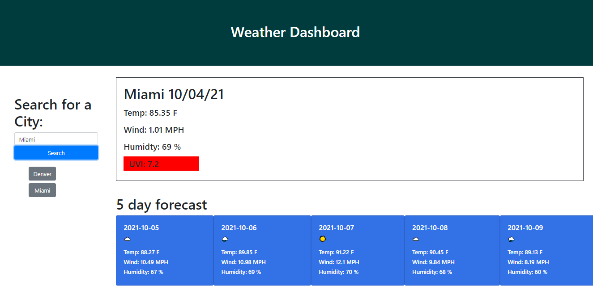
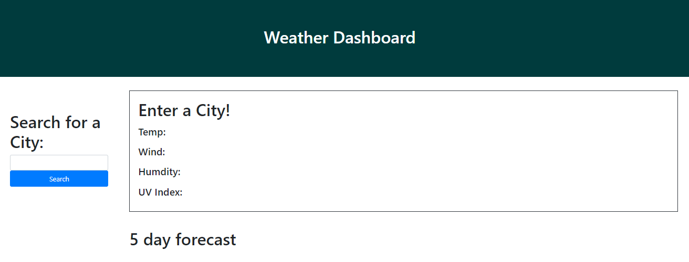
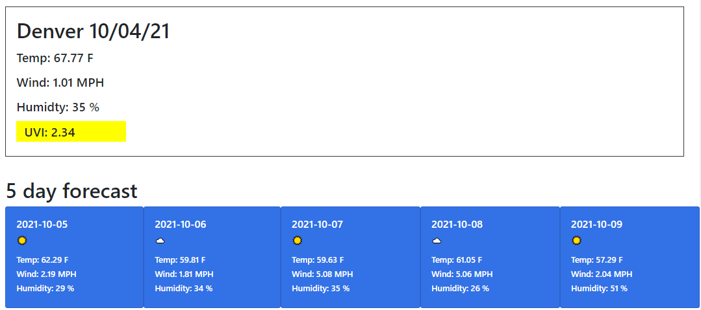
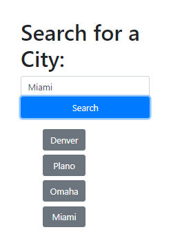
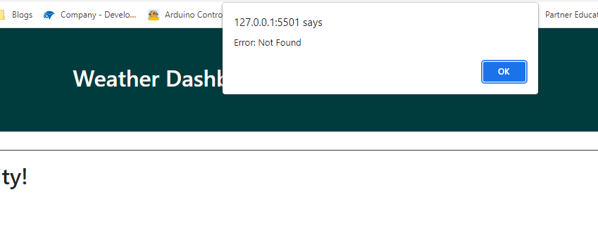

# weather_api

The following project was conducted to leverage the open weather API to allow a user to search for cities and discover current weather information as well as a five day forcast.

<H2>Author</H2>
Nick Ross

<H2>Functionality</H2>

When a user enters the page, they are asked to search for a city

Upon search, both the current day and 5 day forcast are presented. UVI index is highlighted in green, yellow, or red depending on serverity. The five day forcast dynamically updates the emoji displayed based on the main weather description for that day.

When a user searches for a city, their search is saved in a list underneather and they can click on these at a later time to research that particular city. All searches are saved in local storage and are rendered when the user comes back to the page.

If a user search for a city that does not exist or performs a typo, they will be presented with an error message and will have to start a new search.

